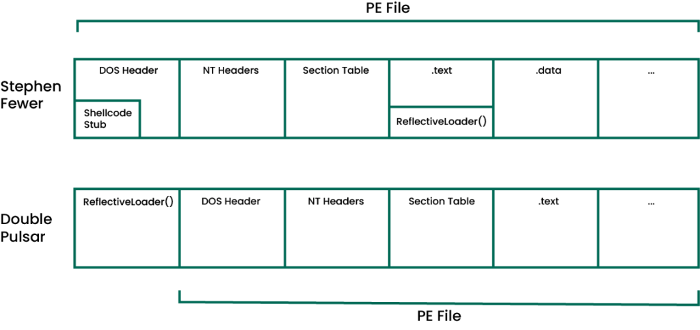
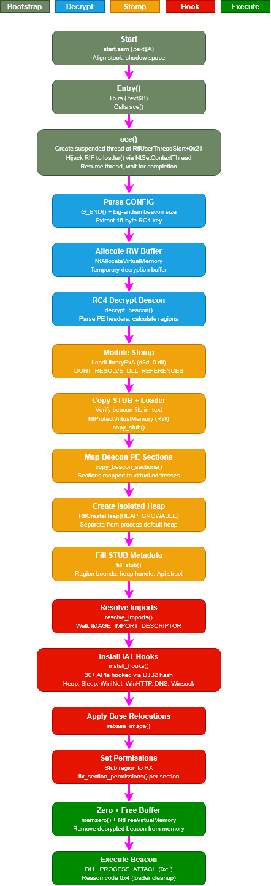

## DoublePulsar

Cobalt Strike User-Defined Reflective Loader (UDRL) written entirely in Rust. A ~65KB position-independent reflective loader with module stomping, synthetic call stack spoofing, sleep obfuscation (Ekko, FOLIAGE, Zilean, XOR), memory encryption, return address spoofing, IAT hooking, and heap isolation.

Named after [DoublePulsar](https://en.wikipedia.org/wiki/DoublePulsar), an implant developed by the NSA's [Equation Group](https://en.wikipedia.org/wiki/Equation_Group), leaked by the Shadow Brokers in 2017.

## Prepended Loader Architecture

Unlike Stephen Fewer's original approach where the reflective loader is compiled into the DLL itself as an exported function, DoublePulsar uses the prepended loader architecture where the loader is placed before the Beacon DLL. The loader is fully position-independent shellcode that decrypts and maps the Beacon payload at runtime.



**Figure 1:** *Prepended vs embedded reflective loader architecture (diagram from [Revisiting the UDRL Part 1](https://www.cobaltstrike.com/blog/revisiting-the-udrl-part-1-simplifying-development) by Robert Bearsby / Cobalt Strike)*

## How It Works

Import the `Titan.cna` script before generating shellcode. The script:
1. Takes your raw Beacon payload
2. RC4 encrypts it with a random 16-byte key
3. Appends `[CONFIG (key + size)][Encrypted Beacon]` to the loader
4. At runtime, the loader decrypts the Beacon in-memory and executes it

## Loader Pipeline



**Figure 2:** *DoublePulsar loader pipeline overview*

## Features

- Position-independent Rust reflective loader for Cobalt Strike (prepended loader)
- Module stomping (loads Beacon into a legitimate module's memory, enabled by default)
- Synthetic call stack spoofing (randomized per call, enabled by default via `spoof-uwd`)
- Dynamic memory encryption (isolated heap for Beacon allocations, encrypted during sleep)
- Code obfuscation and encryption (non-executable + encrypted during sleep)
- Return address spoofing via `spoof_uwd!` on all hooked API calls
- IAT hooking (30+ APIs, fully customizable)
- Heap isolation via `RtlCreateHeap`
- RC4 encryption via SystemFunction032/040/041
- Optional syscall dispatch (cringe, but it's there 🙄) (`spoof-syscall` feature, requires `spoof-uwd`). Uses [Hell's Gate](https://github.com/am0nsec/HellsGate) for SSN resolution when unhooked, falls back to Halo's Gate / [Tartarus Gate](https://github.com/trickster0/TartarusGate) when hooks are detected. Dispatches via indirect syscall (jumps to the `syscall; ret` instruction inside ntdll)
- Does not use Cobalt Strike's Sleepmask or BeaconGate. Sleep obfuscation is handled entirely through IAT hooks
- Multiple sleep obfuscation techniques:

| Feature | Technique | Description |
|---------|-----------|-------------|
| `sleep-ekko` | Ekko | Timer-based (TpAllocTimer/TpSetTimer) + RC4 + NtContinue chain + fiber support **(default)** |
| `sleep-foliage` | FOLIAGE | APC-based (NtQueueApcThread) + RC4 + NtContinue chain + fiber support |
| `sleep-zilean` | Zilean | Wait-based (TpAllocWait/TpSetWait) + RC4 + NtContinue chain + fiber support |
| `sleep-xor` | XOR | XOR section masking + plain Sleep (no CONTEXT chain, no fiber mode) |

## Building

x64 only. x86 is not supported.

Recommended: build on Ubuntu/WSL to avoid MinGW relocation issues on Windows.

### Requirements

- Rust nightly with `x86_64-pc-windows-gnu` target
- MinGW-w64
- [cargo-make](https://github.com/sagiegurari/cargo-make)
- nasm

### Ubuntu/WSL Setup (Recommended)

```bash
# Install Rust nightly and add target
curl --proto '=https' --tlsv1.2 -sSf https://sh.rustup.rs | sh
rustup toolchain install nightly
rustup default nightly
rustup target add x86_64-pc-windows-gnu

# Install MinGW-w64 and nasm
sudo apt update
sudo apt install -y mingw-w64 nasm

# Install cargo-make
cargo install cargo-make

# Build
cd udrl
cargo make x64
```

### Build Commands

```bash
cargo make x64        # x64 release
cargo make x64-debug  # x64 with debug logging (DbgPrint)
cargo make clean      # clean build artifacts
```

### Sleep Feature Selection

Only enable one sleep feature at a time. They are mutually exclusive. Use `--no-default-features` when selecting a non-default technique.

```bash
# Ekko (default)
cargo make x64

# FOLIAGE
cargo build --release --target x86_64-pc-windows-gnu --features sleep-foliage --no-default-features

# Zilean
cargo build --release --target x86_64-pc-windows-gnu --features sleep-zilean --no-default-features

# XOR (no ROP chain, no fiber)
cargo build --release --target x86_64-pc-windows-gnu --features sleep-xor --no-default-features
```

### Output

```
bin/Titan.x64.bin    - x64 shellcode
```

## Detection

Tested on Windows 10 (Build 19045) and Windows 11 (Build 22631) against Elastic 9.0.1 (trial) in prevention mode with aggressive settings and all rules enabled at the time of writing. Integrations enabled: Elastic Defend, Elastic Agent, Fleet Server, Prebuilt Security Detection Rules, Elastic Synthetics, System, and Windows. Cobalt Strike settings: Stageless Windows Executable, Raw output, x64 payload, Process exit function, winhttp library. YARA rules for detection are provided in [doublepulsar.yar](doublepulsar.yar). Shortly after the release of this project, in the same month, Elastic published a [behavioral rule targeting the call stack patterns](https://github.com/elastic/protections-artifacts/blob/278054cb0e90dca20d6fe06f63cce6600902d50d/behavior/rules/windows/defense_evasion_api_call_from_a_suspicious_stack.toml) produced by [SilentMoonwalk](https://github.com/klezVirus/SilentMoonwalk)-based spoofing implementations like [uwd](https://github.com/joaoviictorti/uwd) used in DoublePulsar.

## Known Issues

- Not compatible with loaders that rely on the shellcode thread staying alive
- Windows builds may encounter relocation errors with newer MinGW versions (use WSL)
- AllocConsole logging can cause crashes when spammed with too many log entries, use DbgPrint instead
- `stage.cleanup` has known limitations with module stomping

## Author

[memN0ps](https://github.com/memN0ps)

## Credits

- [Austin Hudson](https://github.com/realoriginal) for [TitanLdr](https://github.com/benheise/TitanLdr) (the original UDRL that inspired AceLdr and DoublePulsar), [FOLIAGE](https://github.com/benheise/FOLIAGE) (APC-based sleep obfuscation), and [titanldr-ng](https://github.com/klezVirus/titanldr-ng) (CNA integration, RC4 beacon encryption/decryption, additional IAT hooks)
- [Kyle Avery](https://github.com/kyleavery) for [AceLdr](https://github.com/kyleavery/AceLdr/), which built on Austin Hudson's TitanLdr design and merged FOLIAGE sleep obfuscation with return address spoofing and heap isolation
- [Arash Parsa (waldo-irc)](https://github.com/waldo-irc) for [Bypassing PE-sieve and Moneta](https://www.arashparsa.com/bypassing-pesieve-and-moneta-the-easiest-way-i-could-find/), [Hook heaps and live free](https://www.arashparsa.com/hook-heaps-and-live-free/), and [MalMemDetect](https://github.com/waldo-irc/MalMemDetect)
- [C5pider](https://github.com/Cracked5pider) for [Stardust](https://github.com/Cracked5pider/Stardust) (PIC framework), [Ekko](https://github.com/Cracked5pider/Ekko) sleep obfuscation (originally discovered by Peter Winter-Smith, implemented in MDSec's Nighthawk), and Zilean sleep obfuscation
- [klezVirus](https://github.com/klezVirus), [Arash Parsa (waldo-irc)](https://github.com/waldo-irc), and [trickster0](https://github.com/trickster0) for [SilentMoonwalk](https://github.com/klezVirus/SilentMoonwalk) (call stack spoofing) and [Tartarus Gate](https://github.com/trickster0/TartarusGate)
- [Joao Victor](https://github.com/joaoviictorti) for [uwd](https://github.com/joaoviictorti/uwd) and [hypnus](https://github.com/joaoviictorti/hypnus), used as reference for a complete rewrite as position-independent code
- [Forrest Orr](https://www.forrest-orr.net/) for [Masking malicious memory artifacts](https://www.forrest-orr.net/post/masking-malicious-memory-artifacts-part-ii-insights-from-moneta)
- [Raphael Mudge](https://www.cobaltstrike.com/profile/raphael-mudge) for creating [Cobalt Strike](https://www.cobaltstrike.com/) and [Crystal Palace](https://tradecraftgarden.org/crystalpalace.html)
- [RastaMouse](https://github.com/rasta-mouse) / [Zero Point Security](https://www.zeropointsecurity.co.uk/) for [Red Team Ops II](https://www.zeropointsecurity.co.uk/course/red-team-ops-ii) and [Crystal-Kit](https://github.com/rasta-mouse/Crystal-Kit)
- [Alex Reid](https://www.zeropointsecurity.co.uk/program/bof-udrl-sleepmask-dev) / [Zero Point Security](https://www.zeropointsecurity.co.uk/) for [BOF, UDRL & Sleepmask Development](https://www.zeropointsecurity.co.uk/program/bof-udrl-sleepmask-dev)
- [namazso](https://github.com/namazso) for the original [x64 return address spoofing](https://www.unknowncheats.me/forum/anti-cheat-bypass/268039-x64-return-address-spoofing-source-explanation.html) technique
- IBM X-Force for [Defining the Cobalt Strike Reflective Loader](https://www.ibm.com/think/x-force/defining-cobalt-strike-reflective-loader)
- [Bobby Cooke](https://github.com/boku7) for [BokuLoader](https://github.com/boku7/BokuLoader)
- [Robert Bearsby](https://www.cobaltstrike.com/blog/revisiting-the-udrl-part-1-simplifying-development) / Cobalt Strike for the Revisiting the UDRL blog series and the prepended loader architecture diagram
- [Lorenzo Meacci](https://lorenzomeacci.com/bypassing-edr-in-a-crystal-clear-way) for Crystal Kit / Tradecraft Garden EDR evasion research
- [Dylan Tran](https://dtsec.us/) for [Module Stomping research](https://dtsec.us/2023-11-04-ModuleStompin/)
- [Stephen Fewer](https://github.com/stephenfewer) for [Reflective DLL Injection](https://github.com/stephenfewer/ReflectiveDLLInjection) (2008)
- [Nick Landers](https://github.com/monoxgas) for [sRDI](https://github.com/monoxgas/sRDI) (Shellcode Reflective DLL Injection)
- [J. Lospinoso](https://github.com/JLospinoso) for [Gargoyle](https://github.com/JLospinoso/gargoyle) (timer-based code execution)
- [F-Secure](https://blog.f-secure.com/) for [Hunting for Gargoyle](https://blog.f-secure.com/hunting-for-gargoyle-memory-scanning-evasion/)
- [Elastic](https://www.elastic.co/) for [Detecting Cobalt Strike with memory signatures](https://www.elastic.co/blog/detecting-cobalt-strike-with-memory-signatures)
- [MDSec Nighthawk study](https://web.archive.org/web/20220625003531/https://suspicious.actor/2022/05/05/mdsec-nighthawk-study.html) for Ekko sleep obfuscation research
- [am0nsec](https://github.com/am0nsec) for [Hell's Gate](https://github.com/am0nsec/HellsGate)
- [Equation Group / NSA](https://en.wikipedia.org/wiki/Equation_Group) for the original [DoublePulsar](https://en.wikipedia.org/wiki/DoublePulsar) implant concept

## License and Disclaimer

**License**: MIT. See [LICENSE](./LICENSE)

**Liability**: The author assumes no responsibility for misuse, damages, or legal consequences arising from the use of this software. Users are solely responsible for ensuring compliance with all applicable laws, regulations, and organizational policies. By using this software, you agree that you have proper authorization for any systems you interact with.
